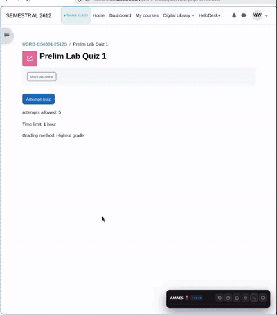

# AMAES Toolkit

> **Compatibility:** Version **1.7.6** is currently supported. Older clients
> are blocked at startup and must be updated from the [official userscript
> link](https://raw.githubusercontent.com/Acads-Tools/amaes-toolkit/main/amaes-toolkit.user.js).
> See [CLIENT-COMPATIBILITY.md](CLIENT-COMPATIBILITY.md) for the policy.

> An assistive study enhancement and question repository client for AMA Education System and ACLC College students on Moodle (`semestral.amaes.com`). Provides real-time answer verification, autonomous study assistance, and zero-PII community question consensus.

  

---

## Features

### 1. Real-Time Answer Verification & Auto-Quiz Assistance
* **Visual Answer Highlighting:** Automatically matches quiz questions against verified ground truth and highlights correct choices in clean green indicators.
* **Autonomous Progression (`Auto-Next`):** Automatically selects verified answers and smoothly advances to the next question.
* **Ground-Truth Safety Gate:** On questions without a confirmed answer, the solver safely pauses, presents a reassuring notification, and lets you review manually or use AI assistance. It never guesses blindly.
* **Live In-Question Controls:** Pause or resume automated assistance directly from the top banner inside any question without closing your workflow.

### 2. Comprehensive Question Type Support
* **Multiple Choice & Multi-Select:** Accurately identifies single-answer choices and multi-answer checkbox groups, ensuring all verified options are checked before proceeding.
* **True / False:** Dedicated ground-truth deduction and option selection.
* **Short Answer & Fill-in-the-Blank (Cloze):** Identifies inline input blanks, normalizes text, and provides 1-click interactive fill hints.
* **Interactive Dropdowns & Matching:** Resolves matching table dropdowns and gap-select options.
* **Drag-and-Drop:** Highlights available choices, marks drop zones, and provides 1-click token placement.

### 3. Privacy-Safe Community Synchronization
* **Automatic Course Bank Loading:** Automatically fetches verified questions for your active subject directly from the open study database ([`Acads-Tools/database`](https://github.com/Acads-Tools/database)) upon opening Moodle.
* **Consensus-Driven Question Sharing:** Confirmed review answers from completed quiz attempts are pooled anonymously to expand coverage for fellow students.
* **Strict Zero-PII Guarantee:** Student names, student IDs, email addresses, passwords, grades, and Moodle session tokens are never collected, logged, or transmitted.

### 4. Built-in Google Gemini AI Assistant (Experimental) & Study Tools
* **Native In-Quiz AI Solver:** Directly answers uncertain Multiple Choice and True/False questions in real time using Google Gemini via a free personal Google AI Studio API key.
* **Session Answer Caching:** Once an answer is suggested or selected by AI, it is cached for that question during the active quiz session. Navigating back and forth between questions instantly restores the choice with **0 API requests and 0 token cost**.
* **Confirmed Wrong Answer Elimination Guard:** Choices confirmed as incorrect by the database or previous attempts are annotated in the AI prompt (`[CONFIRMED WRONG - DO NOT SELECT]`) and hard-blocked by solver guards. If only 1 valid alternative remains, the toolkit deduces it automatically.
* **Configurable Retry Attempts:** Easily configure AI retry attempts (1 to 5, default: **2 retries**) directly from Quiz tab settings or Course Tools.
* **Auto-Copy Question on AI Failure:** Toggleable option (default: **ON**) that automatically copies the formatted question to clipboard if AI times out or fails, enabling immediate `Ctrl+V` pasting into external AI models.
* **Token-Conservation Architecture:** Strictly triggers only on questions without confirmed answers in the database, consuming **0 tokens** on known questions.
* **Auto-Select or Suggestion Review:** Choose between automated choice selection or visual highlighting with a `✦ AI Suggestion (Gemini)` badge and purple outline for manual confirmation.
* **Watchdog Timer & Safe Fallbacks:** 8-second timeout, interactive cancel button, and an in-question fallback bar with `[ ↺ Retry AI ]` and `[ ✦ Copy for AI ]`. Complex formats (drag-and-drop, dropdown matching, short answers) automatically fall back to manual copy.
* **Instant Keystroke Shortcuts:**
  * `C`: Formats the active question, choices, and instructions ready for your preferred AI tool.
  * `V`: Automatically parses clipboard content and selects matching choices or fills text inputs in the browser.

### 5. Autonomous Web Scraper Fallback Engine
* **Background Study Search:** When an answer is missing from the local database, the toolkit searches verified online study guides and extracts confirmed answer keys automatically.

### 6. Course Navigation & Assessment Overview
* **Term Breakdown & Tracking:** Displays verified question counts organized by academic term (Prelim, Midterm, Prefi, Final).
* **Direct Course Access:** Provides 1-click navigation to course modules, grade breakdowns, and syllabus activities.

---

## Installation & Setup

### Step 1: Install a Userscript Manager (Violentmonkey Recommended)
Install the **[Violentmonkey](https://violentmonkey.github.io/)** extension for your browser:

* **Google Chrome / Brave:**
  1. Install Violentmonkey from the [Chrome Web Store](https://chromewebstore.google.com/detail/violentmonkey/jinjaccalgkegednnccohejagnlnfdag).
  2. Open `chrome://extensions` in your address bar (or click the Extensions icon in your browser toolbar).
  3. In the top-right corner, toggle **Developer mode** to **ON**.
  4. Under Violentmonkey, ensure **Allow access to user scripts** is turned **ON**.
  5. Pin Violentmonkey to your browser toolbar for quick access.

* **Mozilla Firefox:**
  1. Install Violentmonkey from [Firefox Add-ons](https://addons.mozilla.org/en-US/firefox/addon/violentmonkey/).
  2. Click the Violentmonkey extension icon in your toolbar to confirm that user scripts are allowed and active.

* **Microsoft Edge:**
  1. Install Violentmonkey from [Edge Add-ons](https://microsoftedge.microsoft.com/addons/detail/violentmonkey/eeagobfjdenkkddmbclomhiblgggliao).
  2. Open `edge://extensions` and enable **Developer mode**.

### Step 2: Install AMAES Toolkit
* Visit the **[AMAES Toolkit Installer Website](https://acads-tools.github.io/amaes-toolkit/)** and click **Install AMAES Toolkit**, or install directly via the [UserScript Raw Link](https://raw.githubusercontent.com/Acads-Tools/amaes-toolkit/main/amaes-toolkit.user.js).
* In the Violentmonkey tab that opens, click the green **"Confirm installation"** button.

### Step 3: Open Moodle
* Navigate to your Moodle portal (e.g., **[semestral.amaes.com](https://semestral.amaes.com/)** or your term's specific portal path like `semestral.amaes.com/xxxx/`, such as `/2612/` depending on your current school year and semester) and log in.
* The toolkit panel will appear in the bottom-right corner of your screen.

### Step 4: (Optional) Setup Free Google Gemini AI
1. In the toolkit panel on Moodle, navigate to the **Course Tools** tab and expand **AI Assistant (Google Gemini)**.
2. Click **Setup Free AI Assistant**.
3. Follow the 4-step guide to get your free personal API key from [Google AI Studio](https://aistudio.google.com/app/apikey) (100% free with any standard Google account).
4. Paste your key and click **Test & Save Key**. The toolkit is now ready to assist with uncertain quiz questions automatically!

Shared AI fallback is enabled by default in the setup window. If Google
temporarily rate-limits your personal key, the toolkit may try a small,
project-managed pool so you do not have to wait. Your personal key is never
uploaded to that pool. Shared capacity is limited; if it is full, the toolkit
will explain what happened and let you retry or add another personal key.
Disable **Use shared AI help if my key is temporarily busy** if you do not
want this fallback.

---

## Keyboard Shortcuts

| Key | Action |
| :--- | :--- |
| `Space` / `N` | Advance to Next Question / Page |
| `C` | 1-Click Copy Formatted Question for AI |
| `V` | Paste AI Answer (Auto-Selects Matching Choice) |
| `P` | Pause / Resume Autonomous Auto-Quiz Progression |
| `1` – `4` / `A` – `D` | Select Choice Option 1 through 4 |
| `H` | Highlight Answers Immediately |
| `?` / `K` | Open Quick Guide & Shortcuts Modal |
| `Esc` | Close Modal / Minimize Toolkit Panel |

---

## Technical Documentation

Comprehensive guides detailing the system architecture, DOM injection model, and anti-sabotage merge engine are available in the **[`docs/`](docs/)** directory:

* **[DOM Injections & UI Overlays](docs/dom-injections.md)**: Catalog of every injected interface element, HUD component, button, and status indicator.
* **[Quiz Lifecycle & Answer Harvesting](docs/quiz-lifecycle-and-harvesting.md)**: Details of question parsing, solver matching tiers, 4-tier ground truth harvesting on review pages, and distractor debunking.
* **[Community Pipeline & Cloud Architecture](docs/pipeline-and-cloud-architecture.md)**: Architecture guide for the serverless consensus pipeline (Cloudflare Worker Relay, GitHub Issues, GitHub Actions, and Python anti-sabotage merge engine).

---

## Frequently Asked Questions

<b>Clicking the install link just shows raw JavaScript code. What should I do?</b>

 
This happens when a userscript manager is not yet installed in your browser. Install <a href="https://violentmonkey.github.io/">Violentmonkey</a> first, or visit the <a href="https://acads-tools.github.io/amaes-toolkit/">Quick Install Site</a> which guides you through browser setup in one click.

<b>Does this tool transmit any personal student data?</b>

 
<b>No.</b> The toolkit operates under a strict privacy-first architecture. It never collects, transmits, or stores student names, student IDs, email addresses, passwords, grades, cookies, or Moodle session tokens. Shared community contributions consist exclusively of anonymous question-and-answer pairs confirmed against Moodle review keys.

<b>What happens when a question is not yet in the database?</b>

 
The auto-solver safely pauses without advancing, displays a notice explaining that no verified answer is known yet, and allows you to review the question manually or use the AI clipboard shortcut. It never guesses blindly.

<b>Why does Chrome require Developer Mode for userscripts?</b>

 
Recent versions of Chromium (Google Chrome and Brave) require users to enable "Developer mode" under <code>chrome://extensions</code> in order for extensions like Violentmonkey to execute userscripts via the User Scripts API. This is a standard browser security requirement and only needs to be enabled once.

---

## Important Use Disclaimer

AMAES Toolkit is an independent, unofficial assistive study tool. It is **not affiliated with, endorsed by, sponsored by, or operated by** AMA Education System, ACLC, Moodle, Violentmonkey, Tampermonkey, or any browser vendor. Product names and trademarks belong to their respective owners.

Use the toolkit only where permitted by your institution, instructor, assessment rules, and applicable law. Do not use it to cheat, impersonate another person, bypass access controls or proctoring, interfere with a service, or submit work that violates academic-integrity policies. You are solely responsible for your use of the software, your account, your data, and anything you submit through Moodle. You must obtain any permission required before using it.

The software and website are provided **“as is” and “as available,”** without warranties or guarantees of any kind, including accuracy, availability, security, fitness for a particular purpose, or non-infringement. The developer and contributors are not responsible for lost data, service interruptions, account actions, academic outcomes, disciplinary action, legal claims, or other direct, indirect, incidental, or consequential losses arising from use or misuse, to the maximum extent permitted by applicable law. Nothing here excludes liability that cannot legally be excluded.

By downloading, installing, accessing, or using the toolkit, you agree to these terms and agree, to the maximum extent permitted by law, to defend and hold harmless the developer and contributors from claims, losses, liabilities, costs, and expenses arising from your violation of these terms, applicable law, or third-party rights. If you do not agree, do not use or install the toolkit. This notice is not legal advice; consult a qualified lawyer about your jurisdiction and circumstances. Review the [Terms of Use](TERMS.md) and [MIT License](LICENSE) before using the project.

---

**Links:** [GitHub Repository](https://github.com/Acads-Tools/amaes-toolkit) • [Quick Install Site](https://acads-tools.github.io/amaes-toolkit/) • [Question Database](https://github.com/Acads-Tools/database) • [Terms of Use](TERMS.md) • [Security Policy](SECURITY.md) • [Greasy Fork](https://greasyfork.org/en/scripts/594744-amaes-toolkit) • [Report a Bug / Request Feature](https://github.com/Acads-Tools/amaes-toolkit/issues)
