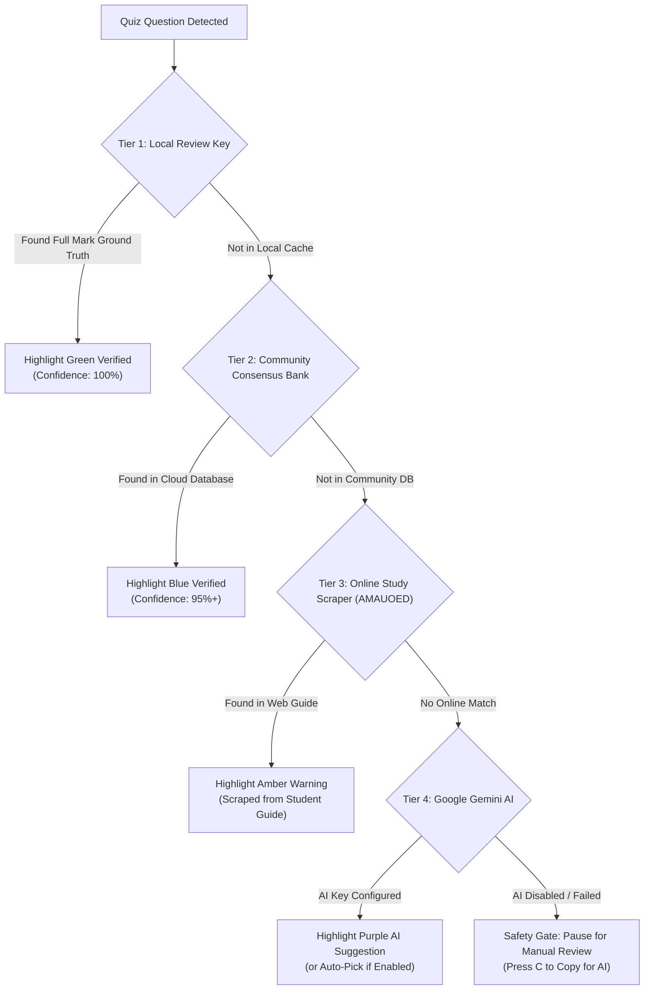

<p align="center">
  
</p>

<h1 align="center">AMAES Toolkit</h1>

<p align="center">
  <b>Universal Assistive Study Toolkit & Offline Question Bank for Moodle Portals</b><br>
  <span>Designed for students on <code>semestral.amaes.com</code></span>
</p>

<p align="center">
  <a href="https://raw.githubusercontent.com/Acads-Tools/amaes-toolkit/main/amaes-toolkit.user.js"></a>
  <a href="https://acads-tools.github.io/amaes-toolkit/"></a>
  <a href="LICENSE"></a>
  <a href="#zero-telemetry--privacy-architecture"></a>
  <a href=".github/workflows/privacy-check.yml"></a>
</p>

> **Compatibility Notice:** Version **1.8.1** is the active supported release. Older clients are blocked at startup and must be updated via Violentmonkey or the [official userscript link](https://raw.githubusercontent.com/Acads-Tools/amaes-toolkit/main/amaes-toolkit.user.js). Review [CLIENT-COMPATIBILITY.md](docs/CLIENT-COMPATIBILITY.md) for full version lifecycle policies.

---

<p align="center">
  
  <br>
  <em>Live in-quiz assistance: visual answer highlighting, autonomous progress guard, and in-question banner controls.</em>
</p>

---

## Table of Contents
* [Prerequisites & Supported Environment](#prerequisites--supported-environment)
* [Key Features](#features)
* [Usage & Features Deep-Dive](#usage--features-deep-dive)
  * [4-Tier Answer Intelligence](#4-tier-answer-intelligence)
  * [Multi-Course Grades Harvester](#multi-course-grades-harvester-batch-scanner)
  * [Autonomous Solver vs Companion Mode](#autonomous-solver-vs-companion-mode)
* [Installation & Setup](#installation--setup)
* [Keyboard Shortcuts](#keyboard-shortcuts)
* [Developer & Contributing Guide](#developer--contributing-guide)
* [Zero Telemetry & Privacy Architecture](#zero-telemetry--privacy-architecture)
* [Frequently Asked Questions](#frequently-asked-questions)
* [Academic Integrity & Liability Disclaimer](#academic-integrity--liability-disclaimer)

---

<a id="prerequisites--supported-environment"></a>

## Prerequisites & Supported Environment

Before installing, ensure your environment meets the following specifications:

| Requirement | Supported Specifications | Notes |
| :--- | :--- | :--- |
| **Supported Browsers** | Google Chrome (v110+), Brave, Microsoft Edge, Mozilla Firefox, Opera | Chromium browsers require "Developer mode" enabled in extensions. |
| **Userscript Manager** | **[Violentmonkey](https://violentmonkey.github.io/)** (Strongly Recommended) or Tampermonkey | Violentmonkey provides the cleanest User Scripts API compatibility. |
| **Target Moodle Portal** | `https://semestral.amaes.com/*` | Supports root domains and specific term subpaths (e.g., `/2612/`). |
| **Network Access** | Unrestricted access to `semestral.amaes.com` and GitHub raw content | Institutional firewall restrictions may block userscript auto-updates. |

---

<a id="features"></a>

## Features

### 1. Real-Time Answer Verification & Auto-Quiz Assistance
* **Visual Answer Highlighting:** Automatically matches quiz questions against verified ground truth and highlights correct choices in clean green indicators.
* **Autonomous Progression (`Auto-Next`):** Automatically selects verified answers and smoothly advances to the next question.
* **Ground-Truth Safety Gate:** On questions without a confirmed answer, the solver safely pauses, presents a reassuring notification, and lets you review manually or use AI assistance. It never guesses blindly.
* **Live In-Question Controls:** Pause or resume automated assistance directly from the top banner inside any question without closing your workflow.

### 2. Comprehensive Question Type Support
* **Multiple Choice & Multi-Select:** Accurately identifies single-answer choices and multi-answer checkbox groups, ensuring all verified options are checked before proceeding.
* **True / False:** Dedicated ground-truth deduction and option selection.
* **Short Answer & Fill-in-the-Blank (Cloze):** Identifies inline input blanks, normalizes text, and provides 1-click interactive fill hints.
* **Interactive Dropdowns & Matching:** Resolves matching table dropdowns and gap-select options.
* **Drag-and-Drop:** Highlights available choices, marks drop zones, and provides 1-click token placement.

### 3. Multi-Course Grades Harvester (Batch Scanner)
* **One-Click Historical Review:** Scans your completed past quiz attempts from Moodle grade reports and catalogs 100% verified answers into your offline database.
* **Elimination Learning:** Automatically records choices confirmed wrong in past attempts, ensuring you never select known incorrect answers again.
* **Dashboard Badges:** Injects live coverage pills (e.g., `45 Verified Answers Cached`) onto course cards on the Moodle homepage.

### 4. Built-in Google Gemini AI Assistant (Experimental) & Study Tools
* **Native In-Quiz AI Solver:** Directly answers uncertain Multiple Choice and True/False questions in real time using Google Gemini via a free personal Google AI Studio API key.
* **Session Answer Caching:** Once an answer is suggested or selected by AI, it is cached for that question during the active quiz session. Navigating back and forth between questions instantly restores the choice with **0 API requests and 0 token cost**.
* **Confirmed Wrong Answer Elimination Guard:** Choices confirmed as incorrect by the database or previous attempts are annotated in the AI prompt (`[CONFIRMED WRONG - DO NOT SELECT]`) and hard-blocked by solver guards. If only 1 valid alternative remains, the toolkit deduces it automatically.
* **Configurable Retry Attempts:** Easily configure AI retry attempts (1 to 5, default: **2 retries**) directly from Quiz tab settings or Course Tools.
* **Auto-Copy Question on AI Failure:** Toggleable option (default: **ON**) that automatically copies the formatted question to clipboard if AI times out or fails, enabling immediate `Ctrl+V` pasting into external AI models.
* **Token-Conservation Architecture:** Strictly triggers only on questions without confirmed answers in the database, consuming **0 tokens** on known questions.
* **Auto-Select or Suggestion Review:** Choose between automated choice selection or visual highlighting with an `AI Suggestion (Gemini)` badge and purple outline for manual confirmation.
* **Watchdog Timer & Safe Fallbacks:** 8-second timeout, interactive cancel button, and an in-question fallback bar with `Retry AI` and `Copy for AI`. Complex formats (drag-and-drop, dropdown matching, short answers) automatically fall back to manual copy.
* **Instant Keystroke Shortcuts:**
  * `C`: Formats the active question, choices, and instructions ready for your preferred AI tool.
  * `V`: Automatically parses clipboard content and selects matching choices or fills text inputs in the browser.

### 5. Autonomous Web Scraper Fallback Engine
* **Background Study Search:** When an answer is missing from the local database, the toolkit searches verified online study guides and extracts confirmed answer keys automatically.

### 6. Privacy-Safe Community Synchronization
* **Automatic Course Bank Loading:** Automatically fetches verified questions for your active subject directly from the open study database ([`Acads-Tools/database`](https://github.com/Acads-Tools/database)) upon opening Moodle.
* **Consensus-Driven Question Sharing:** Confirmed review answers from completed quiz attempts are pooled anonymously to expand coverage for fellow students.
* **Strict Zero-PII Guarantee:** Student names, student IDs, email addresses, passwords, grades, and Moodle session tokens are never collected, logged, or transmitted.

---

<a id="usage--features-deep-dive"></a>

## Usage & Features Deep-Dive

### 4-Tier Answer Intelligence
The toolkit evaluates every question through a 4-tier verification hierarchy to maximize accuracy and safety:



1. **Tier 1 (Local Verified Review Key - 100% Ground Truth):** Scraped directly from your own graded quizzes scoring 1.00/1.00. Marked with a green checkmark pill.
2. **Tier 2 (Community Verified Consensus Bank):** Merged from anonymous peer review keys via [`Acads-Tools/database`](https://github.com/Acads-Tools/database).
3. **Tier 3 (Online Study Guide Scraper - AMAUOED):** Scrapes student study guides when the local library has no match. Marked with an amber warning badge.
4. **Tier 4 (Google Gemini AI Engine):** Solves remaining Multiple Choice or True/False questions on-the-fly. Marked with an `AI Suggestion` purple pill.

### Multi-Course Grades Harvester (Batch Scanner)
The Grades Harvester allows you to quickly build an answer library for all your enrolled subjects by scanning past graded quizzes in seconds.

* **How it Works:** Rather than manually opening every quiz, the Harvester visits Moodle's User Grade Report (`/grade/report/user/index.php`), inspects all completed attempts that scored full marks, and saves confirmed answers into your offline `localStorage`.
* **How to Trigger:**
  * **Automatic:** Runs silently once per session when viewing your Moodle Dashboard (`/my/`) or course homepages.
  * **Manual Trigger:** Open the toolkit panel > **Database** tab > click **Sync & Scan Past Quizzes**.

### Autonomous Solver vs Companion Mode
The toolkit offers two distinct operational modes depending on your preference:

* **Companion Mode (Default):** Highlights verified choices visually on screen but **never clicks or advances automatically**. You retain 100% control of every choice and button click.
* **Autonomous Auto-Quiz Solver:** Selects verified answers and clicks "Next page" automatically.
  * **How to Enable:** In the **Quiz** tab, toggle **Auto-Quiz Mode: ON** (or press keyboard shortcut `P`).
  * **Safety Gate:** If a question has no confirmed answer, the solver pauses automatically, brings up the in-question toolbar, and sounds an intervention chime.

---

<a id="installation--setup"></a>

## Installation & Setup

### Step 1: Install a Userscript Manager (Violentmonkey Recommended)
Install the **[Violentmonkey](https://violentmonkey.github.io/)** extension for your browser:

* **Google Chrome / Brave:**
  1. Install Violentmonkey from the [Chrome Web Store](https://chromewebstore.google.com/detail/violentmonkey/jinjaccalgkegednnccohejagnlnfdag).
  2. Open `chrome://extensions` in your address bar (or click the Extensions icon in your browser toolbar).
  3. In the top-right corner, toggle **Developer mode** to **ON**.
  4. Under Violentmonkey, ensure **Allow access to user scripts** is turned **ON**.
  5. Pin Violentmonkey to your browser toolbar for quick access.

* **Mozilla Firefox:**
  1. Install Violentmonkey from [Firefox Add-ons](https://addons.mozilla.org/en-US/firefox/addon/violentmonkey/).
  2. Click the Violentmonkey extension icon in your toolbar to confirm that user scripts are allowed and active.

* **Microsoft Edge:**
  1. Install Violentmonkey from [Edge Add-ons](https://microsoftedge.microsoft.com/addons/detail/violentmonkey/eeagobfjdenkkddmbclomhiblgggliao).
  2. Open `edge://extensions` and enable **Developer mode**.

### Step 2: Install AMAES Toolkit
* Visit the **[AMAES Toolkit Installer Website](https://acads-tools.github.io/amaes-toolkit/)** and click **Install AMAES Toolkit**, or install directly via the [UserScript Raw Link](https://raw.githubusercontent.com/Acads-Tools/amaes-toolkit/main/amaes-toolkit.user.js).
* In the Violentmonkey tab that opens, click the green **"Confirm installation"** button.

### Step 3: Open Moodle
* Navigate to your Moodle portal (e.g., **[semestral.amaes.com](https://semestral.amaes.com/)** or your term's specific portal path like `semestral.amaes.com/xxxx/`, such as `/2612/` depending on your current school year and semester) and log in.
* The toolkit panel will appear in the bottom-right corner of your screen.

### Step 4: (Optional) Setup Free Google Gemini AI
1. In the toolkit panel on Moodle, navigate to the **Course Tools** tab and expand **AI Assistant (Google Gemini)**.
2. Click **Setup Free AI Assistant**.
3. Follow the 4-step guide to get your free personal API key from [Google AI Studio](https://aistudio.google.com/app/apikey) (100% free with any standard Google account).
4. Paste your key and click **Test & Save Key**. The toolkit is now ready to assist with uncertain quiz questions automatically!

Shared AI fallback is enabled by default in the setup window. If Google temporarily rate-limits your personal key, the toolkit may try a small, project-managed pool so you do not have to wait. Your personal key is never uploaded to that pool. Shared capacity is limited; if it is full, the toolkit will explain what happened and let you retry or add another personal key. Disable **Use shared AI help if my key is temporarily busy** if you do not want this fallback.

---

<a id="keyboard-shortcuts"></a>

## Keyboard Shortcuts

| Key | Action |
| :--- | :--- |
| `Space` / `N` | Advance to Next Question / Page |
| `C` | 1-Click Copy Formatted Question for AI |
| `V` | Paste AI Answer (Auto-Selects Matching Choice) |
| `P` | Pause / Resume Autonomous Auto-Quiz Progression |
| `1` – `4` / `A` – `D` | Select Choice Option 1 through 4 |
| `H` | Highlight Answers Immediately |
| `?` / `K` | Open Quick Guide & Shortcuts Modal |
| `Esc` | Close Modal / Minimize Toolkit Panel |

---

<a id="developer--contributing-guide"></a>

## Developer & Contributing Guide

Contributions, bug reports, and pull requests from students and developers are warmly welcomed.

### Technology Stack
* **Core Language:** Vanilla JavaScript (ES2022+ / Standard DOM APIs).
* **Architecture:** Modular component architecture in `src/` with zero runtime dependencies.
* **Styling & UI:** Pure CSS3 Variables, CSS Grid / Flexbox, SVG Vector Icons.
* **Serverless Relay:** Cloudflare Workers, Cloudflare D1 SQL database.
* **Automated Testing:** Node.js VM test harness (`tests/test_toolkit.js`, 143 test cases).

### Reporting Bugs & Feature Requests
* **In-App 1-Click Bug Reporter:** While on Moodle, click the **Bug icon** (`#amaes-bug-btn`) in the toolkit header. Describe the issue, review attached sanitized logs, and submit directly to create a tracking issue.
* **GitHub Issues:** Open an issue via the [GitHub Issue Tracker](https://github.com/Acads-Tools/amaes-toolkit/issues).

### Modular Source Architecture & Building from Source
The repository is structured with clean domain modules in `src/` and an automated build pipeline:

```text
src/
├── meta.js              # Tampermonkey / Violentmonkey header block
├── init.js              # Lifecycle bootstrapper & DOM observers
├── core/                # Configuration, versioning & unified HTTP client
├── moodle/              # Question parsing, course & activity detectors
├── quiz/                # Autonomous solver & DOM event bindings
├── ai/                  # Gemini client, rate limiter & prompt formatter
├── sync/                # Auto-updater, study scraper & review harvester
├── ui/                  # Theme CSS, SVG icons, panel & modal HTML
└── dev/                 # Diagnostics log exporter & secret developer console
```

#### Build & Test Commands
Prerequisites: Node.js 18+.

```bash
# Clone the repository
git clone https://github.com/Acads-Tools/amaes-toolkit.git
cd amaes-toolkit

# Bundle src/ into distribution file amaes-toolkit.user.js
npm run build

# Run the comprehensive 143-test regression suite
npm test

# Validate JavaScript syntax
npm run syntax
```

### Privacy & Contributor Rules
* **Mandatory Zero-PII Rule:** All commits must adhere strictly to anonymous project identity:
  ```bash
  git config user.name "AcademicContributor"
  git config user.email "academic-contributor@users.noreply.github.com"
  ```
* Automated CI enforces `.github/workflows/privacy-check.yml` on every pull request, blocking personal names, file paths, and private emails.

---

<a id="zero-telemetry--privacy-architecture"></a>

## Zero Telemetry & Privacy Architecture

Privacy is the foundational design requirement of AMAES Toolkit:

* **100% Client-Side Execution:** All question matching, solver algorithms, and option selection happen inside your browser tab.
* **Zero Account Tracking:** The toolkit has no analytics trackers, no Google Analytics, no Facebook pixels, and no telemetry pings.
* **Encrypted Relay:** When sharing confirmed review questions with the community consensus bank, questions are stripped of student identifiers, user IDs, timestamps, and cookies before transmission.

---

<a id="frequently-asked-questions"></a>

## Frequently Asked Questions

<details>
<summary><b>Clicking the install link just shows raw JavaScript code. What should I do?</b></summary>
<br>
This happens when a userscript manager is not yet installed in your browser. Install <a href="https://violentmonkey.github.io/">Violentmonkey</a> first, or visit the <a href="https://acads-tools.github.io/amaes-toolkit/">Quick Install Site</a> which guides you through browser setup in one click.
</details>

<details>
<summary><b>Does this tool transmit any personal student data?</b></summary>
<br>
<b>No.</b> The toolkit operates under a strict privacy-first architecture. It never collects, transmits, or stores student names, student IDs, email addresses, passwords, grades, cookies, or Moodle session tokens. Shared community contributions consist exclusively of anonymous question-and-answer pairs confirmed against Moodle review keys.
</details>

<details>
<summary><b>What happens when a question is not yet in the database?</b></summary>
<br>
The auto-solver safely pauses without advancing, displays a notice explaining that no verified answer is known yet, and allows you to review the question manually or use the AI clipboard shortcut. It never guesses blindly.
</details>

<details>
<summary><b>Why does Chrome require Developer Mode for userscripts?</b></summary>
<br>
Recent versions of Chromium (Google Chrome and Brave) require users to enable "Developer mode" under <code>chrome://extensions</code> in order for extensions like Violentmonkey to execute userscripts via the User Scripts API. This is a standard browser security requirement and only needs to be enabled once.
</details>

---

<a id="academic-integrity--liability-disclaimer"></a>

## Academic Integrity & Liability Disclaimer

> [!CAUTION]
> ### Important Institutional & Academic Integrity Notice
> AMAES Toolkit is developed and distributed solely as an assistive study companion, accessibility aid, and personal revision question repository.
> 
> * **The tool is provided "as is" for educational and accessibility purposes.** It is intended for concept revision, self-testing, and assistive navigation.
> * **The authors and contributors are not responsible for any academic penalties, account suspensions, or violations of institutional Terms of Service.** Users are solely responsible for ensuring that their use complies with their school's Student Handbook, Academic Honesty Policies, assessment guidelines, and Moodle portal rules.
> * **Users assume all risks associated with deploying automated scripts on institutional platforms.** The authors accept zero liability for any grade invalidations, academic sanctions, or disciplinary actions.
> * **No Institutional Affiliation:** AMAES Toolkit is an independent, unofficial open-source project. It is **not affiliated with, endorsed by, sponsored by, or operated by** AMA Education System (AMAES), AMA University, Moodle Pty Ltd, Violentmonkey, Tampermonkey, or any browser vendor.
> 
> The software is provided **"AS IS" and "AS AVAILABLE"** under the [MIT License](LICENSE), without warranty of any kind, express or implied. By installing or using this software, you assume all responsibility and risk associated with its use. Review the complete [Terms of Use](docs/TERMS.md) before installing.

---

**Links:** [GitHub Repository](https://github.com/Acads-Tools/amaes-toolkit) • [Quick Install Site](https://acads-tools.github.io/amaes-toolkit/) • [Question Database](https://github.com/Acads-Tools/database) • [Terms of Use](docs/TERMS.md) • [Security Policy](SECURITY.md) • [Greasy Fork](https://greasyfork.org/en/scripts/594744-amaes-toolkit) • [Report a Bug / Request Feature](https://github.com/Acads-Tools/amaes-toolkit/issues)
